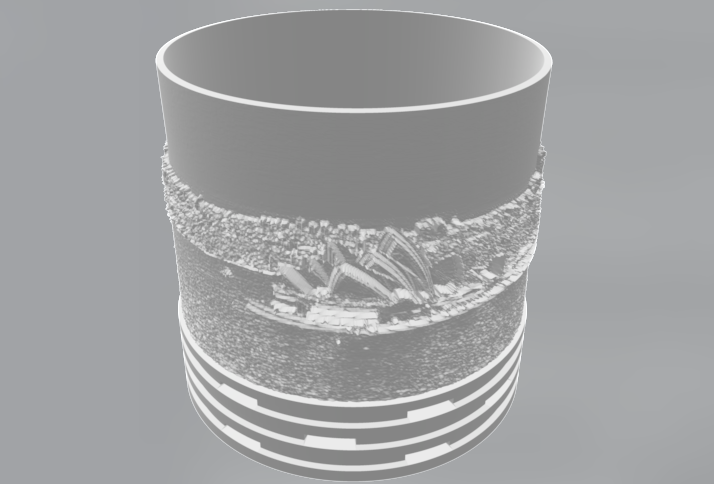

# Lithophane Generator

Generates STL files based on input images, to be viewed with a light source placed behind.
Output can be flat or round, which is intended for a candle to be used as the light source.


## Requirements
Uses python and the following (pip-available) packages:  
* `numpy`  
* `numpy-stl`
* `imageio`


## Usage
Example image (named sydney.jpeg):  


Example command:  
```
python3 lithogen.py round sydney.jpeg --candle_radius=20 --radius=30
```

Example output:  
Provided as [an stl file](example/sydney.stl) and as an image:  



## Authors
[Marc Katzef](https://katzef.com)
